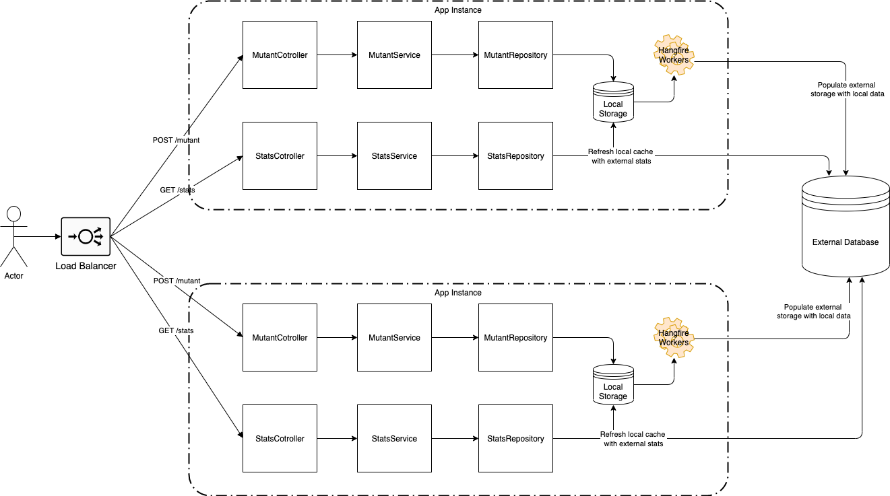

# Mutants

## Introducción
Mutants es una aplicación simple hecha con .Net Core. Se utiliza para evaluar ADNs y determinar si son mutantes o humanos, basado en la presencia de "secuencias mutantes", y mantener el regitro de los ADNs analizados.
Requerimientos completos [aquí](https://github.com/fadibrace/mutants-meli/blob/master/extras/requirements.pdf)

## Correr localmente

Tener instalado .Net Core 3 o superior y SQL Server 2008 o superior.
Agregar la informacion de conexión con la base de data en el archivo appsettings.json y buildear.
Al ejecutar la aplicación, tendremos el proyecto corriendo en https://localhost:5002 y http://localhost:5000.
En la carpeta `extras` se encuentra un archivo llamado `locustfile.py` con el cual se pueden realizar pruebas de carga de la aplicación utilizando [locust](https://locust.io/)

## Acceder a la aplicación
La aplicación se encuentra corriendo en `https://meli-mutants-283418.rj.r.appspot.com` en instancias provistas por Google Cloud Platform.
Se pueden realizar peticiones `HTTP GET` a `/stats` para obtener las estadísticas de los ADNs analizados, y peticiones `HTTP POST` al endpoint `/mutant` para determinar si el ADN provisto pertenece a un mutante o no.

Ejemplos:

Mutante (Respuesta HTTP 200 OK):
```
curl --request POST \
  --url https://meli-mutants-283418.rj.r.appspot.com/mutant/ \
  --header `content-type: application/json` \
  --data `{"dna":["ATGCGA","CAGTGC","TTATGT","AGAAGG","CCCCTA","TCACTG"]}`
```
Humano (Respuesta HTTP 403 Forbidden):
```
curl --request POST \
  --url https://meli-mutants-283418.rj.r.appspot.com/mutant/ \
  --header `content-type: application/json` \
  --data `{"dna":["ACGT","GTAC","ACGT","GTAC"]}`
```
Estadísticas:
```
curl --request GET \
  --url https://meli-mutants-283418.rj.r.appspot.com/stats/
```


## Arquitectura

Podría verse a la aplicación como una app que implementa un diseño CQRS simple, en el que hay por un lado los comandos (POST /mutant), y por otro las lecturas (GET /stats).
A su vez, cada uno de estos flujos de lectura/comando esta implementado en tres capas:
- capa de Controllers, encargada de recibir requests Http
- capa de Servicios, donde se encuentra la lógica de negocio
- capa de Repositorios, encargada de acceder y almacenar los datos

Cada instancia de la aplicación cuenta con un almacenamiento de datos local en memoria, de rápido acceso para lectura y escritura.
Aquí se almacenan los ADNs procesados por la instancia y tambien un cache con las estadísticas de los ADNs procesados por la aplicación.
Al correr una instancia de la aplicación, se ejecutan en segundo plano procesos encargados de migrar los datos del almacenamiento local de cada instancia a la base de datos de la aplicación.

Estos mecanismos le permiten a la aplicación soportar mayores volumenes de cargas, pero tambien resultan en que la aplicacion trabaje con consistencia eventual.
